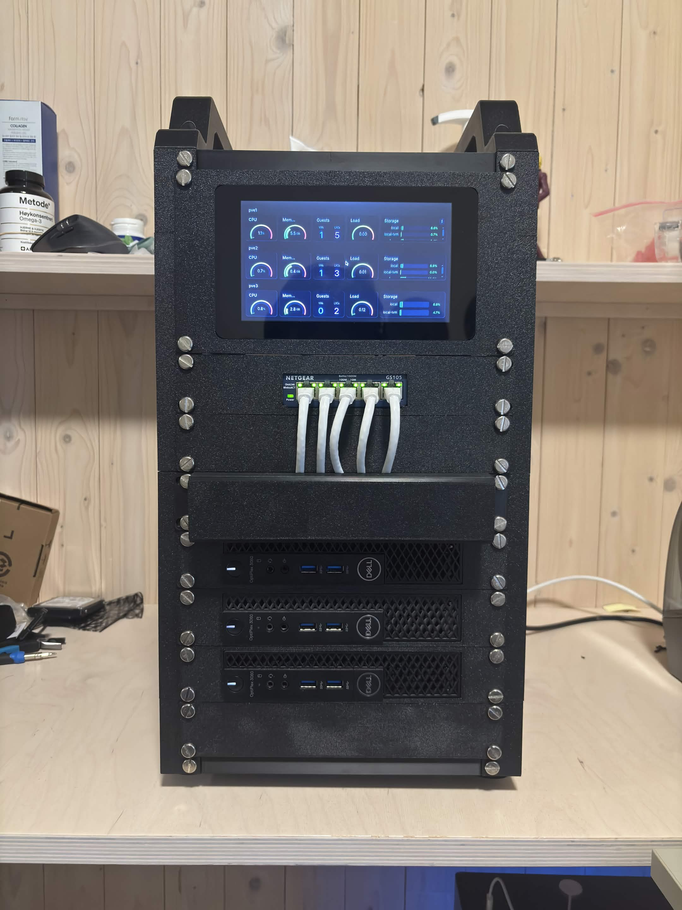
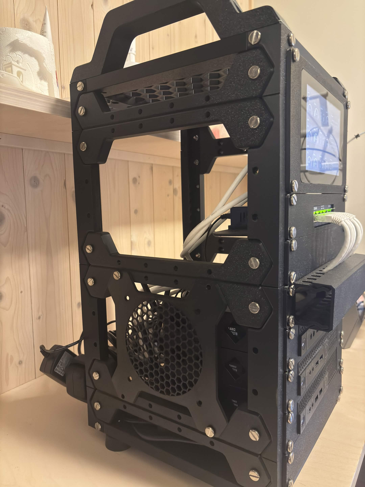

# 🏠 Homelab

Welcome to my homelab! This repository documents my setup and tracks my progress as it grows.

My homelab journey started during the second year of my bachelor's degree with a single Raspberry Pi 5. Since then, it has grown into a 10-inch rack running a three-node Proxmox cluster. The lab serves two main purposes:

- **Learning** – a hands-on platform for experimenting with IT concepts such as Infrastructure as Code (Terraform/OpenTofu, Ansible, Kubernetes and more)
- **Hosting** – a home for my personal projects and self-hosted services

So far I've learned a lot about hardware and virtualization, which I go into in more detail below.

---

## 📸 Pictures





---

## 🖥️ Hardware

### Compute nodes

All three nodes are **Dell OptiPlex 3060 Micro** mini PCs.

| Node | CPU | Memory | Storage |
|------|-----|--------|---------|
| **PVE1** | Intel Core i5-8500T (6C/6T) | 16 GB DDR4 | 512 GB NVMe + 512 GB SATA SSD |
| **PVE2** | Intel Core i5-8500T (6C/6T) | 16 GB DDR4 | 256 GB NVMe + 256 GB SATA SSD |
| **PVE3** | Intel Core i5-8500T (6C/6T) | 16 GB DDR4 | 256 GB NVMe + 1 TB HDD |

**Cluster total:** 18 cores · 48 GB RAM · ~2.8 TB raw storage

### Other hardware

| Device | Purpose |
|--------|---------|
| Raspberry Pi 3B + official 7" display | Monitoring dashboard (Grafana) |
| Netgear GS105 | 5-port gigabit network switch |

---

## ⚙️ Services

All three machines run together as a **Proxmox VE cluster**, with services deployed as LXC containers or virtual machines.

### PVE1

| Service | Description |
|---------|-------------|
| AdGuard Home | Network-wide DNS and ad blocking |
| Vaultwarden | Self-hosted password manager |
| Hermes Agent | AI agent |
| Finn.no Bot | Web scraper for Finn.no listings |
| Discord Bot | Custom Discord bot |
| Minecraft Server | Game server |

### PVE2

| Service | Description |
|---------|-------------|
| Immich | Self-hosted photo and video library |
| Nginx Proxy Manager | Reverse proxy |
| Tailscale | Mesh VPN for remote access |
| ~~Portfolio Website~~ | *Retired* |

### PVE3

| Service | Description |
|---------|-------------|
| InfluxDB | Time-series database for cluster metrics |
| Grafana | Monitoring dashboards |

---

## 🧱 Architecture

- **Virtualization** – Every node runs **Proxmox VE**, a hypervisor OS. The three nodes are joined into a single cluster, so they can be managed from one interface.
- **Containers first** – Most services run in **LXC containers** for resource efficiency. The majority are based on Ubuntu, with a few on Debian.
- **Remote access** – **Tailscale** provides secure access to the lab from anywhere without exposing ports to the internet.
- **Monitoring** – Proxmox sends cluster metrics (CPU, memory, storage and more) to **InfluxDB**. **Grafana** visualizes the selected metrics on the Raspberry Pi display for at-a-glance monitoring.

```
            ┌──────────────── Proxmox VE Cluster ────────────────┐
            │                                                    │
            │   PVE1            PVE2             PVE3            │
            │   AdGuard         Immich           InfluxDB ◄──┐   │
            │   Vaultwarden     Nginx PM         Grafana     │   │
            │   Bots & apps     Tailscale           │        │   │
            │                                       │   metrics  │
            └───────────────────────────────────────┼────────┴───┘
                                                    ▼
                                         Raspberry Pi 3B + 7" display
```

---

## 🗺️ Roadmap
- [ ] Manage infrastructure with Terraform/OpenTofu
- [ ] Automate configuration with Ansible
- [ ] Experiment with Kubernetes
